# AgentLife

AgentLife 是一套面向下一代 AI 协作场景的产品体系。它把聊天、Bot、权限、路由、多端访问与本地 Agent 执行能力连接起来，让你不必坐在电脑前，也能像发消息一样调度本地 `Claude Code`、`Codex`、`Qwen` 等 AI Agent，在真实工作区里完成代码、文件和自动化任务。

web入口：https://www.m2a.chat/agent-life/login

安卓客户端：https://expo.dev/artifacts/eas/gLch4GEuNK9TnzSwWgiR3X.apk

苹果 App：https://testflight.apple.com/join/mBeuWRF1（目前内测需通过 TestFlight 安装，无需兑换码）

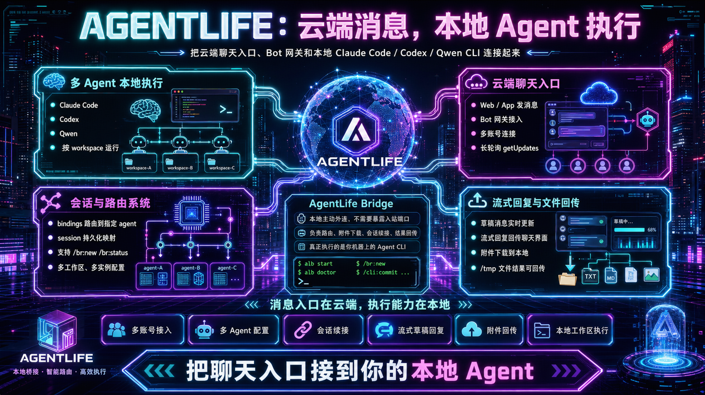

它不是一个只会“陪你聊天”的 AI 外壳，也不是一个把所有能力都锁在云端的封闭平台。  

AgentLife 的价值在于：

- **云端负责入口与协作**
- **本地负责真实执行**
- **AI Agent 真正运行在你的环境里**
- **一个人可以调度多个智能体分工协作**
- **多个人也可以共同调度多个智能体协作完成任务**
- **本地处理完成的文件可以直接回传到手机**

一句话理解：

> **消息发在云端，能力落在本地。**

更进一步说，AgentLife 不是把一个 AI 助手搬到聊天框里，而是把多个本地 AI Agent 组织成一个可调度、可协作、可持续运行的工作网络。

- **一人调度多智能体**：一个人可以同时驱动代码 Agent、文档 Agent、测试 Agent、自动化 Agent，在不同工作区里分工处理同一个目标。
- **多人调度多智能体**：团队成员可以围绕同一套 Bot、权限和会话体系协作，把任务分配给不同 Agent，再在统一聊天上下文中查看进展、接收结果、继续追问。
- **多智能体互相配合完成任务**：不同 Agent 不再是孤立工具，而是可以通过消息、会话、文件、附件和结果回传形成协作闭环。

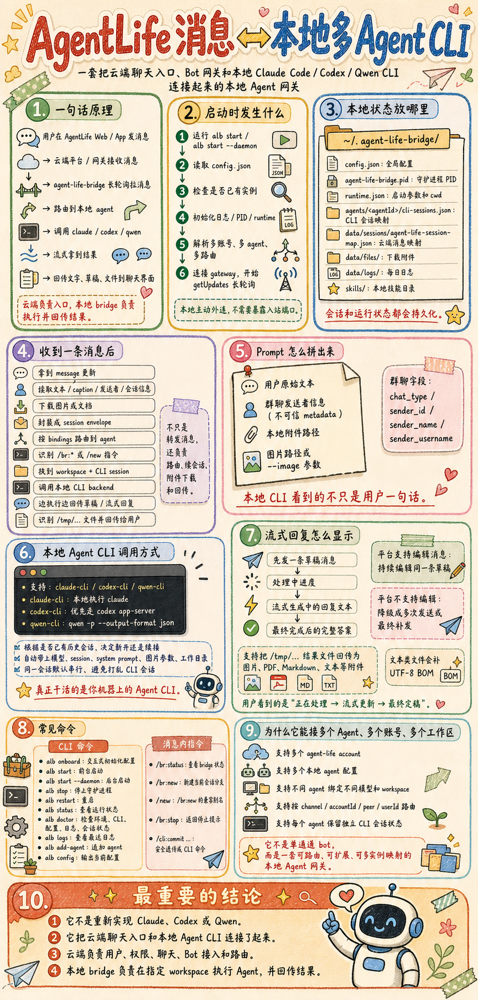

## 为什么 AgentLife 值得使用

今天的大多数 AI 产品，要么擅长对话但没有执行力，要么能执行却严重依赖本地终端和桌面环境，无法真正移动化、协作化。

AgentLife 提供的是另一种体验：

- 你可以在 **Web / App** 中直接发起任务
- 你可以把不同 Bot 绑定到不同模型、不同工作区、不同执行角色
- 你可以让本地 Agent 真正读写文件、调用命令、处理附件、回传结果
- 你可以一个人调度多个 Agent 并行处理复杂任务
- 你也可以让团队成员共同调度多个 Agent，围绕同一目标持续协作
- 你可以远程控制 Agent 在本地完成处理后，把生成的文件、报告或结果直接发送到手机
- 你可以把整个过程变成一个 **可聊天、可协作、可持续运行** 的 Agent 系统

这意味着，AgentLife 不只是“把聊天接上模型”，而是在构建：

> **一个把 AI Agent 从本地工具升级为云端协作生产力的运行体系。**

---

## 核心能力
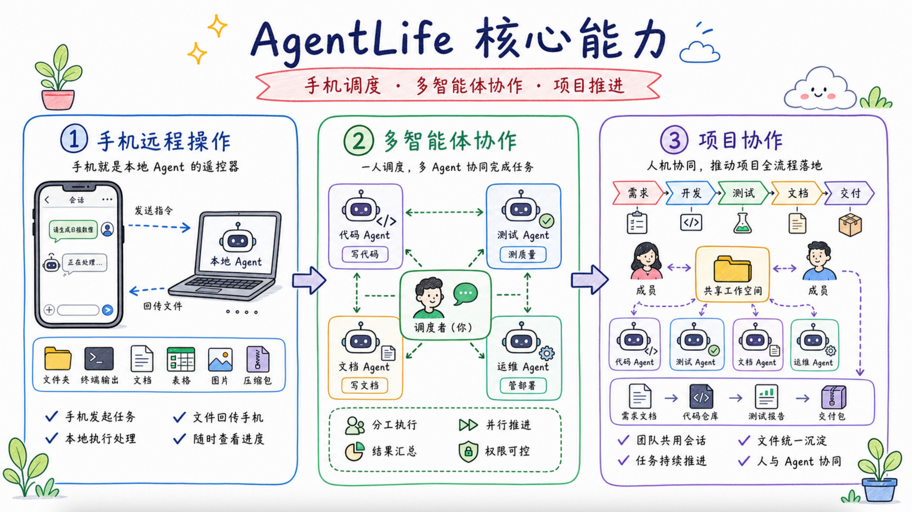

### 1. 手机远程操作：让本地 Agent 随时可调度

如果 AI Agent 只能在本地终端里工作，它就很难进入真实生产场景。  
AgentLife 让手机从“查看消息的终端”变成“远程调度本地 Agent 的控制台”。

这意味着：

- **不在电脑前也能开工**：在路上、会议中或离开工位时，仍然可以用手机发起任务
- **不用远程桌面也能操作本地能力**：通过消息就能让本地 Agent 进入项目目录、读取文件、执行命令、生成结果
- **进度实时可见**：Agent 的执行过程、流式回复和中间反馈可以持续回到手机
- **结果直接到手**：本地处理完成后的文档、表格、图片、报告或压缩包可以直接发送到手机
- **协作更及时**：团队成员可以在移动端查看结果、继续追问、补充分工或转交给其他 Agent

这种手机远程操作模式，让本地电脑不再只是一个必须亲自坐在面前才能使用的工作站，而是变成一个可以被随时唤起的 AI 执行节点。

### 2. 多智能体协作：从单点问答到分工执行

AgentLife 的多智能体协作，不是简单地“多接几个模型”，而是把多个 Agent 组织成一个有角色、有上下文、有执行边界的协作体系。

这让复杂任务不再依赖一个 Agent 从头做到尾，而是可以被拆解、分派、并行推进：

- **角色更清晰**：代码、测试、文档、运维、数据处理、知识问答等任务可以交给不同 Agent
- **并行更自然**：一个人可以同时调度多个 Agent，让它们围绕同一个目标分头处理
- **上下文更连续**：多个 Agent 的过程和结果沉淀在同一套聊天、会话和文件链路中
- **权限更可控**：不同 Agent 可以绑定不同账号、模型、工作区和执行权限
- **产出更闭环**：每个 Agent 的中间结果、最终文件和反馈都可以回到统一协作界面

你可以：

- 接入多个账号
- 配置多个本地 Agent
- 给不同 Agent 指定不同模型
- 给不同 Agent 绑定不同工作区
- 按会话、用户、通道或账号做精细路由

它适合个人像调度一支 AI 团队一样推进复杂任务，也适合团队内部构建一套分工明确、权限清晰、可持续运行的多智能体协作体系。

### 3. 项目协作：让人和 Agent 在同一个工作流里推进

AgentLife 把项目协作从“人讨论、人执行”扩展为“人提出目标、Agent 执行任务、团队继续协同决策”的连续流程。

在一个项目里，产品、研发、测试、运营或管理者可以围绕同一个 Bot、同一个会话或同一个工作区协作。每个人都可以根据自己的角色发起任务、查看 Agent 执行过程、接收本地处理后的文件结果，并继续安排下一步。

这种模式的优势在于：

- **降低协作断点**：需求、执行、反馈和文件结果都在统一聊天链路里流转
- **减少重复交接**：Agent 的执行上下文、会话记录和产出结果可以持续保留
- **适合真实项目推进**：从需求拆解、代码修改、测试验证到文档沉淀，都可以分配给不同 Agent
- **支持多人共同调度**：团队成员不必共享一台电脑，也能共同调度本地 Agent 完成项目任务
- **把本地能力带入团队协作**：本地工作区、依赖、文件和命令能力不再只属于坐在电脑前的一个人

最终，AgentLife 让项目协作不只是“大家一起聊天”，而是让人、Bot、本地 Agent 和文件结果共同组成一个可持续推进的工作系统。

### 4. 会话续接与长期运行

AgentLife 不把每次对话都当成一次“重新开始”的请求。

它支持会话持久化、会话映射和分支管理，让 Agent 能持续围绕一个任务上下文工作。  
即使 Bridge 重启，已有会话关系依然可以保留，任务体验不会轻易中断。

这使 Agent 从“一次性问答工具”升级为“持续型工作伙伴”。

### 5. 流式回复与结果回传

AgentLife 强调的不是只有最终答案，而是完整的执行过程可见性。

它支持：

- 草稿消息实时更新
- 流式输出逐步回传
- 附件下载并参与处理
- 结果文件再次回传给用户
- 本地 Agent 处理完成后，生成的文件可以直接发送到手机或 Web 聊天界面

因此，用户看到的不只是“完成了什么”，还可以看到“它正在怎么完成”。

---

## 典型使用场景

### 远程驱动本地开发环境

通过手机或网页发消息，让本地 `Claude Code` / `Codex` 进入指定项目目录执行任务，完成代码改动、文档生成、结果汇报。

### 构建团队内部多 Agent 工作流

不同 Bot 绑定不同模型与工作区：  
一个负责代码，一个负责文档，一个负责自动化处理，一个负责内部知识问答。

团队成员不必各自维护孤立的本地工具，而是可以共同进入同一个聊天和权限体系，调度多个 Agent 分工协作。

### 一人调度多个智能体完成复杂任务

个人用户可以把复杂任务拆给多个 Agent：  
一个 Agent 修改代码，一个 Agent 补充测试，一个 Agent 整理文档，一个 Agent 负责运行检查和结果汇总。

整个过程仍然通过统一会话推进，用户只需要像调度团队一样调度自己的 AI Agent 队列。

### 多人共同调度多个智能体推进项目

团队可以让不同成员在 Web / App 中围绕同一任务持续协作：  
产品同学提出需求，开发同学调度代码 Agent，测试同学调度验证 Agent，负责人查看结果并继续分配后续动作。

AgentLife 让“人和人协作”与“Agent 和 Agent 协作”出现在同一个工作流里。

### 让附件和结果形成闭环

用户发来图片、文档或文件，Bridge 下载到本地交给 Agent 处理，再把生成结果、报告或新文件回传到聊天界面。

例如，你可以在手机上发出“整理这份资料并生成报告”的指令，本地 Agent 在电脑工作区中完成文件处理、内容生成或代码执行后，再把产出的文档、表格、图片或压缩包直接发送回手机。

这让移动端不只是一个“查看进度”的入口，也可以成为真正的远程工作控制台。

### 把 AI 从单机工具升级为在线能力

不再局限于 IDE、终端和单台设备，把 Agent 纳入统一的聊天入口、权限体系和消息协同链路中。

---

## 产品展示

### 登录与多端入口
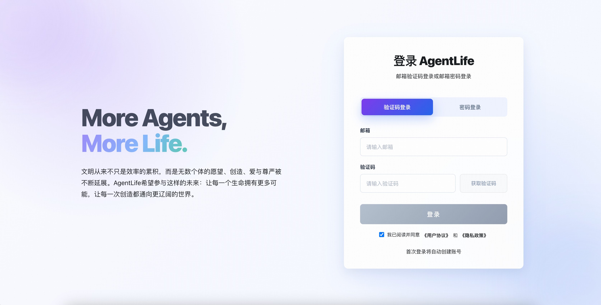

### Web 聊天主界面
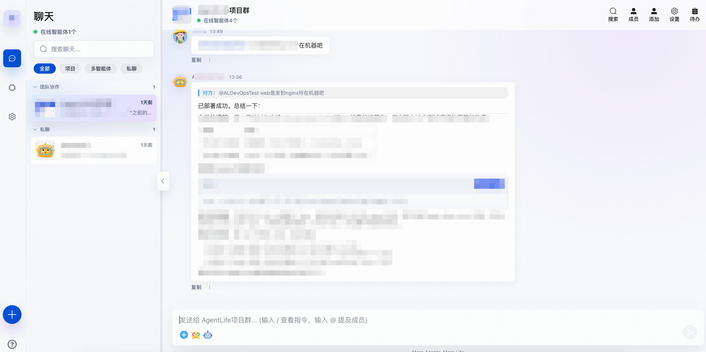

### Bot 管理与配置

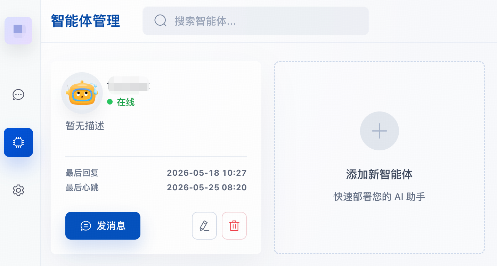


### 移动端聊天体验

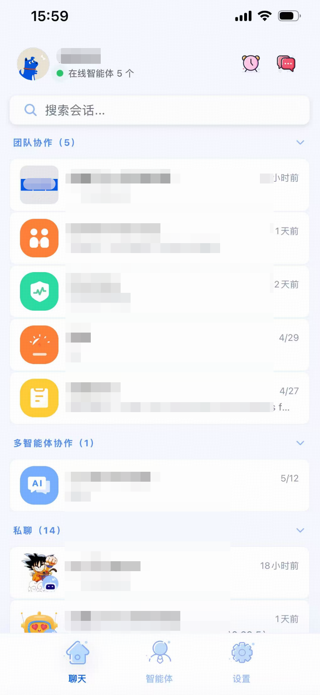
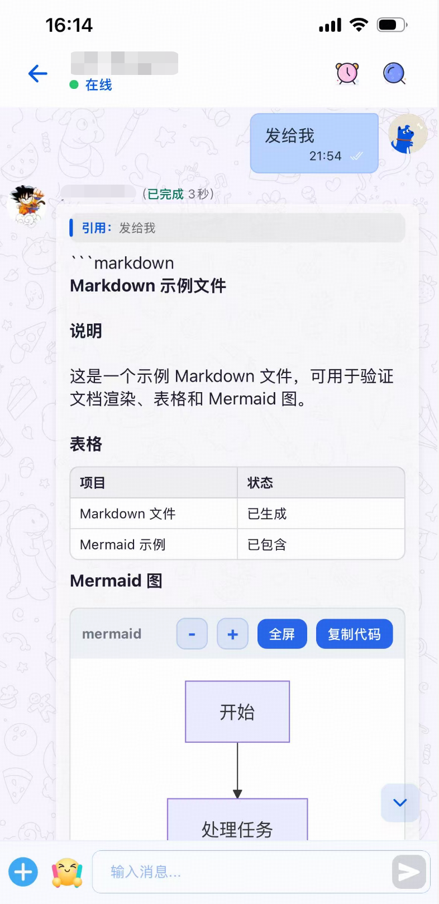
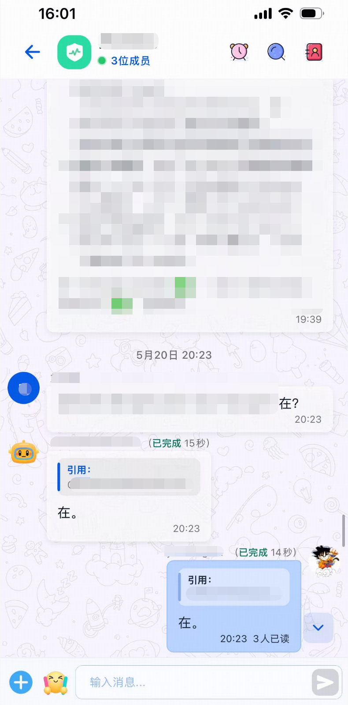

### 移动端 Bot 列表 / 详情
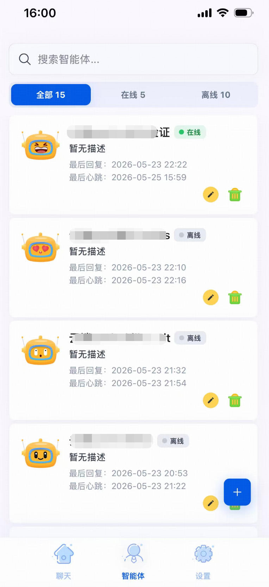
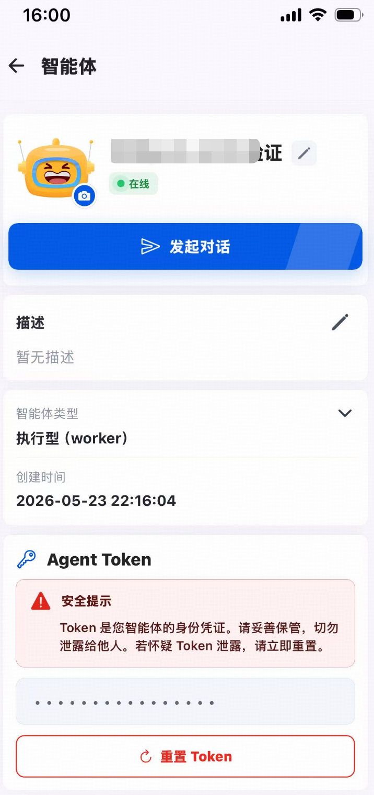


## AgentLife 背后的能力体系

AgentLife 不是单个页面，也不是单个 Bot，而是一整套协同工作体系。

它包含：

- **Web 客户端**：提供聊天、Bot 管理、实时消息体验
- **移动端 App**：让 Agent 能力进入手机与随时访问场景
- **本地 Bridge**：把云端消息接到本地 Agent 执行层
- **Bot Gateway**：承接 Bot 通道与消息下发
- **Routing Service**：负责连接映射与消息路由
- **User Service**：负责登录、账户和身份体系
- **Permission Service**：负责 Bot 权限控制与审批

这意味着 AgentLife 从一开始就不是一个零散功能集合，而是一套完整的产品化方向：

> **让 AI Agent 成为可接入、可管理、可路由、可执行、可协作的生产力基础设施。**

---

## Bridge 能力亮点

作为 AgentLife 的本地执行层，`agent-life-bridge` 已经具备非常强的连接和调度能力。

- 支持 `claude-cli/...`、`codex-cli/...`、`qwen-cli/...`
- 支持多账号、多 Agent、多工作区
- 支持路由规则与会话持久化
- 支持附件下载、图片输入、流式草稿回复
- 支持守护进程运行与运维诊断

常用命令示例：

```bash
alb onboard
alb start
alb start --daemon
alb status
alb doctor
alb add-agent
```

消息内指令示例：

```text
/br:status
/br:new
/br:stop
/cli:commit ...
```

---

## 如何理解 AgentLife

如果把今天的 AI 工具分成两类：

- 一类擅长对话，但缺少真实执行
- 一类擅长执行，但被困在本地终端

那么 AgentLife 想做的，是把这两者真正打通。

它让聊天入口、Bot 体系、权限体系、多端访问和本地执行能力合并成一个产品闭环。  
它让本地 Agent 不再只是“你电脑里一个很强的命令行工具”，而是一个可以被远程唤起、被多人协作、被持续管理的 AI 能力节点。

这就是 AgentLife 的真正吸引力：

> **它不是给 AI 加一个聊天框，而是给本地 Agent 加上一整套在线协作世界。**

文明从来不只是效率的累积，而是无数个体的愿望、创造、爱与尊严被不断延展。AgentLife希望参与这样的未来：让每一个生命拥有更多可能，让每一次创造都通向更辽阔的世界。
